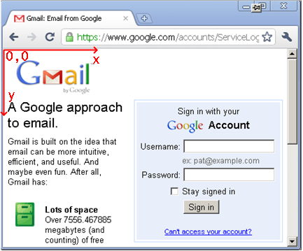
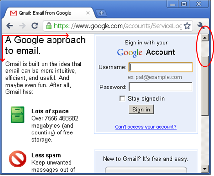

# 浏览器的坐标系统

## 概览

1. 坐标系统
2. 通过`offsetParent`定位元素坐标
3. 正确方法：`elem.getBoundingClientRect`
3. 两种方法对比
4. 组合方式
5. 总结

浏览器中有两种坐标系统：

1. 相对于`document`的坐标系统：原点在文档的左上角，可记为**文档坐标**
2. 相对于`window`的坐标系统：原点在当前可见区域的左上角，可记为**视口坐标**

## 坐标系统

如果文档没有滚动，window和document坐标是相同的，原点也是同一个：


文档滚动之后，可见区域随之从文档的开始位置移动：


实际上，转换这两个坐标系统非常容易。文档坐标等于视口坐标加上滚动距离。

大部分情况下我们只会用到文档坐标，因为它们在滚动之后还是保持不变的。

## 通过`offsetParent`定位元素坐标

元素坐标是指元素左上角的坐标。可惜没有单个的元素属性能给出元素坐标。不过，元素坐标可以通过`offsetTop/offsetLeft`和`offsetParent`来计算得到。


要计算元素在文档的绝对坐标，一种自然的（但我们会发现是有bug的）计算方法是遍历`offsetParent`链，然后把`offsetLeft/offsetTop`累加起来，如下：
```js
function getOffsetSum(elem) {
  var top=0, left=0

  while(elem) {
    top = top + parseInt(elem.offsetTop)
    left = left + parseInt(elem.offsetLeft)
    elem = elem.offsetParent
  }

  return {top: top, left: left}
}
```

这种方法主要有两个缺点：

1. 它是有bug的，不同的浏览器有不同的坑，考虑计算边框和滚动距离时也会有问题；
2. 运行的比较慢，每次计算我们都需要遍历整个`offsetParents`链。

当然，写出跨浏览器、修复所有问题的代码也是可能的，但我们可以看看另外一种Internet Explorer 6+, Firefox 3+, Opera 9.62+和现代的Safari/Chrome浏览器都支持的替代方案。

## 正确方法：`elem.getBoundingClientRect`

这个方法是包含在W3C标准中的，大多数现代的浏览器都实现了它（包括IE）。更多信息可参考[MDN](https://developer.mozilla.org/en-US/docs/Web/API/Element/getBoundingClientRect)。

这个方法将返回围绕元素的矩形，返回矩形是一个包含`top`, `left`, `right`, `bottom`属性的对象。

这四个数字代表了坐标的左上角和右下角。比如，执行下面的函数就能返回按钮元素的矩形：

```js
<input id="brTest" type="button" value="Show button.getBoundingClientRect()" onclick='showRect(this)'/>

<script>
function showRect(elem) {
  var r = elem.getBoundingClientRect()
  alert("Top/Left: "+r.top+" / "+r.left)
  alert("Right/Bottom: "+r.right+" / "+r.bottom)
}
</script>
```

**这个方法返回的坐标是相对于`window`而不是`document`的。** 例如，如果你滚动了文档，让按钮接近于窗口的顶部，返回矩形的`top`也会接近于`0`，因为它是相对于`window`的。要计算元素相对于`document`的坐标，我们就要加入文档的滚动距离。

> 什么是`elem.getBoundingClientRect()`？
>
> 根据CSS的详细标准，任何内容都是被一个称为*CSS box*的矩形围绕着的。如果是块级元素，比如`DIV`——元素本身就形成了一个矩形。这种矩形称为*block box*。但如果一个元素是内联的且包含长文本，它就需要多个矩形来显示。每一行都是一个矩形。这种矩形称为*anonymous box*。这种情形在CSS详细标准中有非常详尽的描述<http://www.w3.org/TR/CSS21/visuren.html#anonymous-block-level>。
> 所以元素内容可以是单个或多个矩形。通过`elem.getClientRects()`可以获取所有的矩形。除了IE<8之外它都能正常工作，不过也无所谓，因为我们不直接调用`getClientRects`。`elem.getBoundingClientRect()`这个方法能得到包含所有`getClientRects()`返回矩形的单个最小矩形。

让我们用`getBoundingClientRect`来写一个新的坐标计算器：

```js
function getOffsetRect(elem) {
    // (1)
    var box = elem.getBoundingClientRect()

    var body = document.body
    var docElem = document.documentElement

    // (2)
    var scrollTop = window.pageYOffset || docElem.scrollTop || body.scrollTop
    var scrollLeft = window.pageXOffset || docElem.scrollLeft || body.scrollLeft

    // (3)
    var clientTop = docElem.clientTop || body.clientTop || 0
    var clientLeft = docElem.clientLeft || body.clientLeft || 0

    // (4)
    var top  = box.top +  scrollTop - clientTop
    var left = box.left + scrollLeft - clientLeft

    return { top: Math.round(top), left: Math.round(left) }
}
```

上述代码中的几个步骤说明如下：

1. 获取围绕元素的矩形。
2. 计算文档的滚动距离。除了IE<9外所有的浏览器都支持`pageXOffset/pageYOffset`，并且在IE中如果设置了DOCTYPE，滚动距离可以通过`documentElement`或者`body`获取 - 哪种可以获取就用哪种。
3. 在IE中文档（`html`或者`body`）可能从左上角偏移，所以要获取这个偏移。
4. 把视口坐标加上滚动距离，然后减去`html/body`的偏移，得到文档坐标。

对于Firefox浏览器，有时需要额外的取整，所以使用了`Math.round()`。

## 两种方法对比

上面给出了两种计算方法：`getOffsetSum`和`getOffsetRect`。两种方法对比的demo可以在<http://javascript.info/tutorial/coordinates>上面看，由于gitbook不支持代码就不再赘述。结论是`getOffsetRect`永远是正确的，`getOffsetSum`则不一定。

## 组合方式

很多框架使用两种计算方法的组合来计算元素的坐标：

```js
function getOffset(elem) {
    if (elem.getBoundingClientRect) {
        return getOffsetRect(elem)
    } else { // old browser
        return getOffsetSum(elem)
    }
}
```

## 总结

坐标系统有两种，基于`document`和基于`window`的坐标（文档坐标和视口坐标）。基于`document`的坐标兼容考虑了文档的滚动，因此大部分情况下都使用它。

两种计算文档坐标的方法：

1. 累加`offsetLeft/Top`——有很多的浏览器bug，不推荐。
2. 使用`getBoundingClientRect`——大部分主流的浏览器都可以正常工作，也支持IE6+。

本文翻译和改编自<http://javascript.info/tutorial/coordinates>。