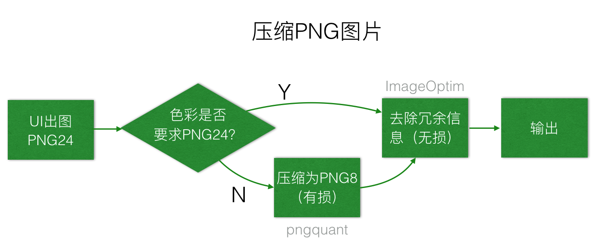
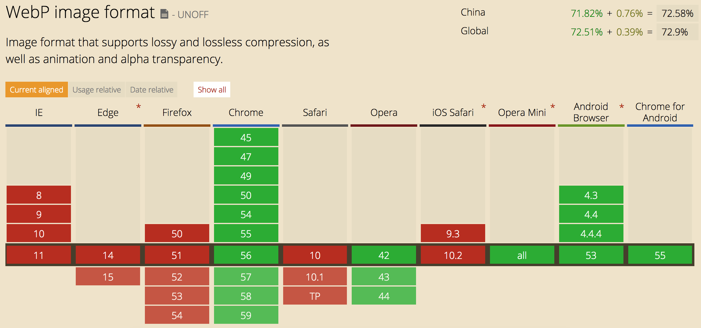
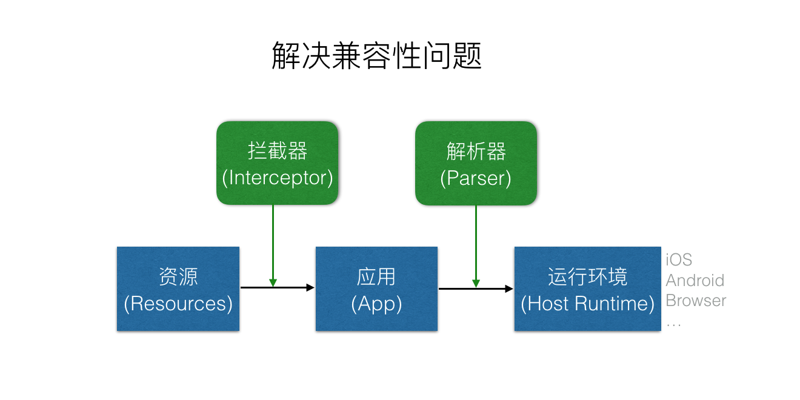
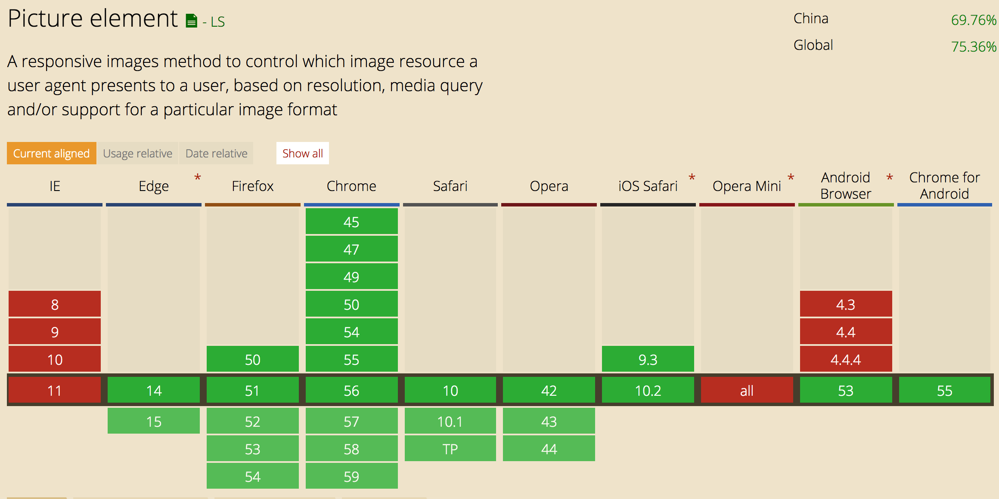
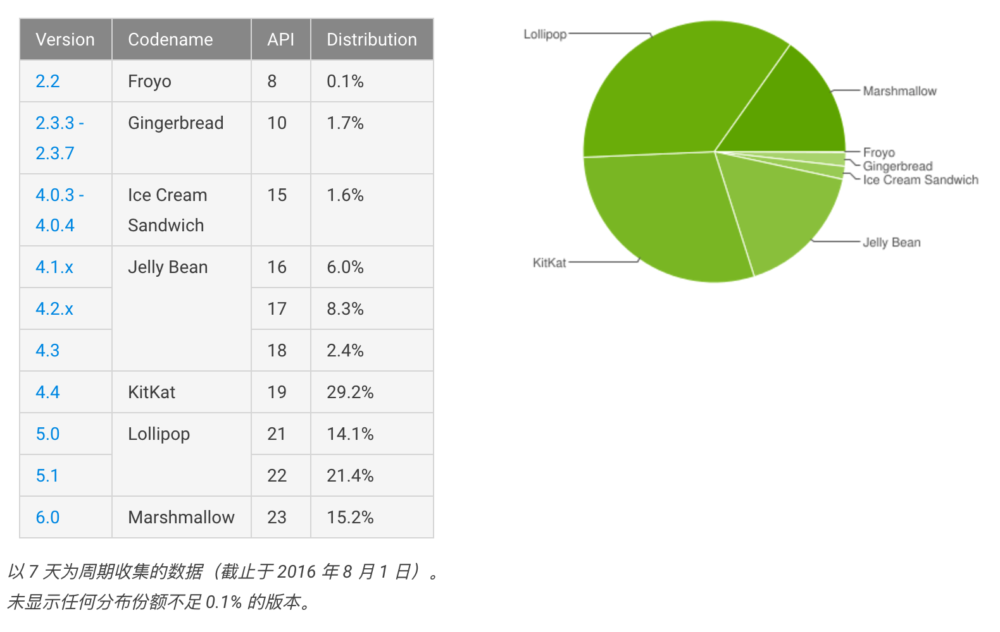
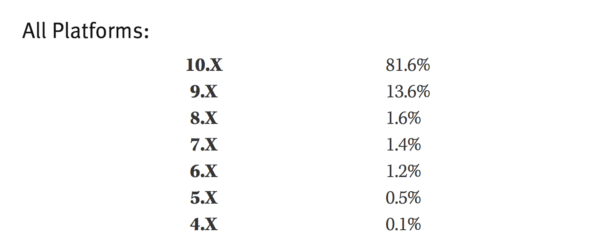

# 移动端 HTML5 项目使用 WebP 图片探讨

## 引言

[**WebP**](https://developers.google.com/speed/webp/)是Google开发的一种图片文件格式，同时支持图片的无损压缩和有损压缩。WebP最初的目标是为了减少文件大小，从而加快网络上的页面访问速度。在相同的图片质量下，无损压缩图片比**PNG**格式小26%，有损压缩图片比**JPEG**小25~34%[^1]。

根据官方的数据，WebP格式有不小的优势——大概有26%的带宽节约。事实上WebP在2010年发布，至今已经接近7年。在2013年我从事手游研发时项目已经全线引入了WebP。如果项目对图片质量要求比较高、图片资源又比较大的话，还是值得引入的。但是HTML5项目[^2]由于本身的一些特殊性，使用WebP图片还是有不少的问题。

另外一点，出于[**政治**](https://www.reddit.com/r/firefox/comments/46wxye/why_is_firefox_still_not_supporting_webp/)（简单来说就是 Google 喜欢推行自己的技术标准，但是 Mozilla 等不一定全盘接受）和[WebP图片本身缺陷](https://news.ycombinator.com/item?id=13021845)的原因，未来 FireFox/Edge/Safari 等浏览器对于 WebP 的支持也没有完全确定。

## 图片格式对比

根据Google官方介绍的数据，WebP平均比PNG图片小26%。在讨论方案前，我挑选了以前项目中用到的60张PNG图片做了对比测试（由于大部分项目使用的图片都是带透明通道的PNG图片，JPEG相对较少，所以只对比了PNG图片）。

### PNG图片压缩

PNG图片的压缩分为无损压缩和有损压缩两种，无损压缩一般是用[ImageOptim](https://imageoptim.com/)去除图片中的冗余信息（大概可以压缩5%左右）；有损压缩一般是从PNG24格式压缩为PNG8格式，[pngquant](https://pngquant.org/)是一个比较流行的库，可以使用[image-webpack-loader](https://github.com/tcoopman/image-webpack-loader)每次打包时自动处理，也可以使用[ImageAlpha](https://pngmini.com/)一次批量处理好放入项目中。

实践中压缩PNG图片的比较好的方法是**pngquant + ImageOptim**，流程大致如下：



> Every Bit Counts.

为了公平对比，使用WebP无损压缩对比PNG无损压缩，WebP有损压缩对比PNG8有损压缩。对于用户访问网络页面来说，Every Bit Counts，很多时候我们会牺牲一些色彩度来大幅度压缩文件（实际上，HTML5项目中很多图片都是处理成PNG8来大幅度提高页面的访问速度），所以PNG8的参考也是必要的——毕竟引入新技术要比生产环境有优势。

### WebP vs PNG24 vs PNG8

为了验证官方数据，我找了一些资源做测试，数据生成方式：

1. 原始图片文件：UI提供，大部分是PhotoShop导出，所以其中不包含照片；
2. WebP Lossless：通过`cwebp -q 100 "$file" -o "$file.webp" -lossless`生成
3. PNG24：ImageOptim批量压缩生成
4. WebP Lossless vs PNG24：`(PNG24大小 - WebPLossless大小) / 原始大小`
5. WebP Loss：通过`cwebp -q 100 "$file" -o "$file.webp"`生成[^3]
4. PNG8：`pngquant --force --ext .png *.png` -\> ImageOptim批量压缩生成
5. WebP vs PNG8：`(PNG8大小 - WebPLoss大小) / 原始大小`

所得数据如下：

<table class="tableizer-table"
       style="text-align: right; border-collapse: collapse;">
    <thead>
    <tr class="tableizer-firstrow"
        style="color: #fff; background-color: #757575">
        <th>图片</th>
        <th>原始大小（字节）</th>
        <th>WebP Lossless</th>
        <th>PNG24</th>
        <th>WebP Lossless vs PNG24</th>
        <th>WebP Loss</th>
        <th>PNG8</th>
        <th>WebP vs PNG8</th>
    </tr>
    </thead>
    <tbody>
    <tr>
        <td>image1.png</td>
        <td>634,022</td>
        <td>456,208</td>
        <td>567,430</td>
        <td style="color: #1d5f1d; background-color: #33cc33">-17.54%</td>
        <td>192,208</td>
        <td>258,189</td>
        <td style="color: #1d5f1d; background-color: #33cc33">-10.41%</td>
    </tr>
    <tr>
        <td>image2.png</td>
        <td>396,419</td>
        <td>108,574</td>
        <td>212,323</td>
        <td style="color: #1d5f1d; background-color: #33cc33">-26.17%</td>
        <td>99,616</td>
        <td>86,209</td>
        <td>3.38%</td>
    </tr>
    <tr>
        <td>image3.png</td>
        <td>202,683</td>
        <td>100,652</td>
        <td>141,316</td>
        <td style="color: #1d5f1d; background-color: #33cc33">-20.06%</td>
        <td>81,742</td>
        <td>55,635</td>
        <td>12.88%</td>
    </tr>
    <tr>
        <td>image4.png</td>
        <td>184,871</td>
        <td>66,424</td>
        <td>100,781</td>
        <td style="color: #1d5f1d; background-color: #33cc33">-18.58%</td>
        <td>49,570</td>
        <td>41,843</td>
        <td>4.18%</td>
    </tr>
    <tr>
        <td>image5.png</td>
        <td>173,382</td>
        <td>85,234</td>
        <td>98,493</td>
        <td style="color: #1d5f1d; background-color: #33cc33">-7.65%</td>
        <td>43,020</td>
        <td>39,856</td>
        <td>1.82%</td>
    </tr>
    <tr>
        <td>image6.png</td>
        <td>173,382</td>
        <td>85,234</td>
        <td>98,493</td>
        <td style="color: #1d5f1d; background-color: #33cc33">-7.65%</td>
        <td>43,020</td>
        <td>39,856</td>
        <td>1.82%</td>
    </tr>
    <tr>
        <td>image7.png</td>
        <td>92,715</td>
        <td>37,084</td>
        <td>58,920</td>
        <td style="color: #1d5f1d; background-color: #33cc33">-23.55%</td>
        <td>62,282</td>
        <td>31,929</td>
        <td>32.74%</td>
    </tr>
    <tr>
        <td>image8.png</td>
        <td>88,804</td>
        <td>58,560</td>
        <td>74,963</td>
        <td style="color: #1d5f1d; background-color: #33cc33">-18.47%</td>
        <td>72,940</td>
        <td>30,366</td>
        <td>47.94%</td>
    </tr>
    <tr>
        <td>image10.png</td>
        <td>81,941</td>
        <td>41,132</td>
        <td>46,453</td>
        <td style="color: #1d5f1d; background-color: #33cc33">-6.49%</td>
        <td>21,864</td>
        <td>20,795</td>
        <td>1.30%</td>
    </tr>
    <tr>
        <td>image9.png</td>
        <td>81,941</td>
        <td>41,132</td>
        <td>46,453</td>
        <td style="color: #1d5f1d; background-color: #33cc33">-6.49%</td>
        <td>21,864</td>
        <td>20,795</td>
        <td>1.30%</td>
    </tr>
    <tr>
        <td>image11.png</td>
        <td>50,071</td>
        <td>18,500</td>
        <td>29,617</td>
        <td style="color: #1d5f1d; background-color: #33cc33">-22.20%</td>
        <td>15,948</td>
        <td>16,072</td>
        <td style="color: #1d5f1d; background-color: #33cc33">-0.25%</td>
    </tr>
    <tr>
        <td>image12.png</td>
        <td>38,768</td>
        <td>14,556</td>
        <td>30,474</td>
        <td style="color: #1d5f1d; background-color: #33cc33">-41.06%</td>
        <td>32,098</td>
        <td>15,727</td>
        <td>42.23%</td>
    </tr>
    <tr>
        <td>image13.png</td>
        <td>32,019</td>
        <td>20,544</td>
        <td>22,851</td>
        <td style="color: #1d5f1d; background-color: #33cc33">-7.21%</td>
        <td>10,120</td>
        <td>17,474</td>
        <td style="color: #1d5f1d; background-color: #33cc33">-22.97%</td>
    </tr>
    <tr>
        <td>image14.png</td>
        <td>25,142</td>
        <td>1,876</td>
        <td>2,893</td>
        <td style="color: #1d5f1d; background-color: #33cc33">-4.05%</td>
        <td>3,370</td>
        <td>2,876</td>
        <td>1.96%</td>
    </tr>
    <tr>
        <td>image15.png</td>
        <td>24,934</td>
        <td>1,688</td>
        <td>2,647</td>
        <td style="color: #1d5f1d; background-color: #33cc33">-3.85%</td>
        <td>2,956</td>
        <td>2,638</td>
        <td>1.28%</td>
    </tr>
    <tr>
        <td>image16.png</td>
        <td>24,775</td>
        <td>1,708</td>
        <td>2,686</td>
        <td style="color: #1d5f1d; background-color: #33cc33">-3.95%</td>
        <td>2,986</td>
        <td>2,672</td>
        <td>1.27%</td>
    </tr>
    <tr>
        <td>image17.png</td>
        <td>24,268</td>
        <td>1,916</td>
        <td>2,873</td>
        <td style="color: #1d5f1d; background-color: #33cc33">-3.94%</td>
        <td>3,224</td>
        <td>2,862</td>
        <td>1.49%</td>
    </tr>
    <tr>
        <td>image18.png</td>
        <td>23,764</td>
        <td>14,062</td>
        <td>15,699</td>
        <td style="color: #1d5f1d; background-color: #33cc33">-6.89%</td>
        <td>7,796</td>
        <td>12,053</td>
        <td style="color: #1d5f1d; background-color: #33cc33">-17.91%</td>
    </tr>
    <tr>
        <td>image19.png</td>
        <td>23,324</td>
        <td>11,414</td>
        <td>16,165</td>
        <td style="color: #1d5f1d; background-color: #33cc33">-20.37%</td>
        <td>19,610</td>
        <td>8,739</td>
        <td>46.61%</td>
    </tr>
    <tr>
        <td>image20.png</td>
        <td>23,274</td>
        <td>1,332</td>
        <td>1,971</td>
        <td style="color: #1d5f1d; background-color: #33cc33">-2.75%</td>
        <td>1,794</td>
        <td>2,169</td>
        <td style="color: #1d5f1d; background-color: #33cc33">-1.61%</td>
    </tr>
    <tr>
        <td>image21.png</td>
        <td>23,083</td>
        <td>9,866</td>
        <td>17,368</td>
        <td style="color: #1d5f1d; background-color: #33cc33">-32.50%</td>
        <td>8,366</td>
        <td>9,856</td>
        <td style="color: #1d5f1d; background-color: #33cc33">-6.45%</td>
    </tr>
    <tr>
        <td>image22.png</td>
        <td>22,347</td>
        <td>1,342</td>
        <td>1,998</td>
        <td style="color: #1d5f1d; background-color: #33cc33">-2.94%</td>
        <td>1,866</td>
        <td>2,177</td>
        <td style="color: #1d5f1d; background-color: #33cc33">-1.39%</td>
    </tr>
    <tr>
        <td>image23.png</td>
        <td>21,356</td>
        <td>8,946</td>
        <td>10,899</td>
        <td style="color: #1d5f1d; background-color: #33cc33">-9.14%</td>
        <td>16,456</td>
        <td>9,089</td>
        <td>34.50%</td>
    </tr>
    <tr>
        <td>image24.png</td>
        <td>21,249</td>
        <td>8,648</td>
        <td>11,021</td>
        <td style="color: #1d5f1d; background-color: #33cc33">-11.17%</td>
        <td>16,108</td>
        <td>6,719</td>
        <td>44.19%</td>
    </tr>
    <tr>
        <td>image25.png</td>
        <td>21,092</td>
        <td>11,978</td>
        <td>14,861</td>
        <td style="color: #1d5f1d; background-color: #33cc33">-13.67%</td>
        <td>6,412</td>
        <td>11,951</td>
        <td style="color: #1d5f1d; background-color: #33cc33">-26.26%</td>
    </tr>
    <tr>
        <td>image26.png</td>
        <td>18,371</td>
        <td>7,670</td>
        <td>9,797</td>
        <td style="color: #1d5f1d; background-color: #33cc33">-11.58%</td>
        <td>13,012</td>
        <td>8,376</td>
        <td>25.24%</td>
    </tr>
    <tr>
        <td>image27.png</td>
        <td>17,826</td>
        <td>7,174</td>
        <td>8,962</td>
        <td style="color: #1d5f1d; background-color: #33cc33">-10.03%</td>
        <td>12,464</td>
        <td>5,934</td>
        <td>36.63%</td>
    </tr>
    <tr>
        <td>image28.png</td>
        <td>17,300</td>
        <td>8,012</td>
        <td>12,771</td>
        <td style="color: #1d5f1d; background-color: #33cc33">-27.51%</td>
        <td>9,196</td>
        <td>8,960</td>
        <td>1.36%</td>
    </tr>
    <tr>
        <td>image29.png</td>
        <td>17,036</td>
        <td>6,964</td>
        <td>8,958</td>
        <td style="color: #1d5f1d; background-color: #33cc33">-11.70%</td>
        <td>11,788</td>
        <td>5,105</td>
        <td>39.23%</td>
    </tr>
    <tr>
        <td>image30.png</td>
        <td>15,814</td>
        <td>8,192</td>
        <td>10,126</td>
        <td style="color: #1d5f1d; background-color: #33cc33">-12.23%</td>
        <td>5,156</td>
        <td>8,222</td>
        <td style="color: #1d5f1d; background-color: #33cc33">-19.39%</td>
    </tr>
    <tr>
        <td>image31.png</td>
        <td>14,561</td>
        <td>6,836</td>
        <td>10,380</td>
        <td style="color: #1d5f1d; background-color: #33cc33">-24.34%</td>
        <td>5,432</td>
        <td>6,708</td>
        <td style="color: #1d5f1d; background-color: #33cc33">-8.76%</td>
    </tr>
    <tr>
        <td>image32.png</td>
        <td>13,288</td>
        <td>5,512</td>
        <td>7,129</td>
        <td style="color: #1d5f1d; background-color: #33cc33">-12.17%</td>
        <td>10,156</td>
        <td>4,085</td>
        <td>45.69%</td>
    </tr>
    <tr>
        <td>image33.png</td>
        <td>13,225</td>
        <td>6,960</td>
        <td>7,645</td>
        <td style="color: #1d5f1d; background-color: #33cc33">-5.18%</td>
        <td>17,464</td>
        <td>6,683</td>
        <td>81.52%</td>
    </tr>
    <tr>
        <td>image34.png</td>
        <td>11,500</td>
        <td>4,990</td>
        <td>8,277</td>
        <td style="color: #1d5f1d; background-color: #33cc33">-28.58%</td>
        <td>9,354</td>
        <td>4,878</td>
        <td>38.92%</td>
    </tr>
    <tr>
        <td>image35.png</td>
        <td>11,307</td>
        <td>610</td>
        <td>1,355</td>
        <td style="color: #1d5f1d; background-color: #33cc33">-6.59%</td>
        <td>2,168</td>
        <td>1,355</td>
        <td>7.19%</td>
    </tr>
    <tr>
        <td>image36.png</td>
        <td>11,239</td>
        <td>588</td>
        <td>1,355</td>
        <td style="color: #1d5f1d; background-color: #33cc33">-6.82%</td>
        <td>2,582</td>
        <td>1,355</td>
        <td>10.92%</td>
    </tr>
    <tr>
        <td>image37.png</td>
        <td>8,703</td>
        <td>546</td>
        <td>1,162</td>
        <td style="color: #1d5f1d; background-color: #33cc33">-7.08%</td>
        <td>1,836</td>
        <td>1,162</td>
        <td>7.74%</td>
    </tr>
    <tr>
        <td>image38.png</td>
        <td>8,468</td>
        <td>2,928</td>
        <td>4,335</td>
        <td style="color: #1d5f1d; background-color: #33cc33">-16.62%</td>
        <td>4,892</td>
        <td>4,036</td>
        <td>10.11%</td>
    </tr>
    <tr>
        <td>image39.png</td>
        <td>6,665</td>
        <td>2,944</td>
        <td>4,350</td>
        <td style="color: #1d5f1d; background-color: #33cc33">-21.10%</td>
        <td>3,258</td>
        <td>3,818</td>
        <td style="color: #1d5f1d; background-color: #33cc33">-8.40%</td>
    </tr>
    <tr>
        <td>image40.png</td>
        <td>5,382</td>
        <td>360</td>
        <td>794</td>
        <td style="color: #1d5f1d; background-color: #33cc33">-8.06%</td>
        <td>1,378</td>
        <td>794</td>
        <td>10.85%</td>
    </tr>
    <tr>
        <td>image41.png</td>
        <td>5,362</td>
        <td>372</td>
        <td>794</td>
        <td style="color: #1d5f1d; background-color: #33cc33">-7.87%</td>
        <td>1,160</td>
        <td>794</td>
        <td>6.83%</td>
    </tr>
    <tr>
        <td>image42.png</td>
        <td>5,234</td>
        <td>1,384</td>
        <td>1,689</td>
        <td style="color: #1d5f1d; background-color: #33cc33">-5.83%</td>
        <td>4,476</td>
        <td>1,689</td>
        <td>53.25%</td>
    </tr>
    <tr>
        <td>image43.png</td>
        <td>4,854</td>
        <td>1,684</td>
        <td>2,457</td>
        <td style="color: #1d5f1d; background-color: #33cc33">-15.93%</td>
        <td>3,806</td>
        <td>2,457</td>
        <td>27.79%</td>
    </tr>
    <tr>
        <td>image44.png</td>
        <td>4,725</td>
        <td>774</td>
        <td>1,369</td>
        <td style="color: #1d5f1d; background-color: #33cc33">-12.59%</td>
        <td>1,946</td>
        <td>1,369</td>
        <td>12.21%</td>
    </tr>
    <tr>
        <td>image45.png</td>
        <td>4,314</td>
        <td>336</td>
        <td>703</td>
        <td style="color: #1d5f1d; background-color: #33cc33">-8.51%</td>
        <td>1,068</td>
        <td>703</td>
        <td>8.46%</td>
    </tr>
    <tr>
        <td>image46.png</td>
        <td>3,831</td>
        <td>1,122</td>
        <td>1,398</td>
        <td style="color: #1d5f1d; background-color: #33cc33">-7.20%</td>
        <td>4,714</td>
        <td>1,398</td>
        <td>86.56%</td>
    </tr>
    <tr>
        <td>image47.png</td>
        <td>3,114</td>
        <td>1,198</td>
        <td>1,715</td>
        <td style="color: #1d5f1d; background-color: #33cc33">-16.60%</td>
        <td>2,444</td>
        <td>1,715</td>
        <td>23.41%</td>
    </tr>
    <tr>
        <td>image48.png</td>
        <td>3,107</td>
        <td>1,018</td>
        <td>1,268</td>
        <td style="color: #1d5f1d; background-color: #33cc33">-8.05%</td>
        <td>2,862</td>
        <td>1,268</td>
        <td>51.30%</td>
    </tr>
    <tr>
        <td>image49.png</td>
        <td>2,832</td>
        <td>880</td>
        <td>1,408</td>
        <td style="color: #1d5f1d; background-color: #33cc33">-18.64%</td>
        <td>2,450</td>
        <td>1,408</td>
        <td>36.79%</td>
    </tr>
    <tr>
        <td>image50.png</td>
        <td>2,825</td>
        <td>862</td>
        <td>1,070</td>
        <td style="color: #1d5f1d; background-color: #33cc33">-7.36%</td>
        <td>2,632</td>
        <td>1,070</td>
        <td>55.29%</td>
    </tr>
    <tr>
        <td>image51.png</td>
        <td>2,642</td>
        <td>874</td>
        <td>1,379</td>
        <td style="color: #1d5f1d; background-color: #33cc33">-19.11%</td>
        <td>2,404</td>
        <td>1,317</td>
        <td>41.14%</td>
    </tr>
    <tr>
        <td>image52.png</td>
        <td>2,611</td>
        <td>970</td>
        <td>1,421</td>
        <td style="color: #1d5f1d; background-color: #33cc33">-17.27%</td>
        <td>2,176</td>
        <td>1,473</td>
        <td>26.92%</td>
    </tr>
    <tr>
        <td>image53.png</td>
        <td>2,581</td>
        <td>486</td>
        <td>794</td>
        <td style="color: #1d5f1d; background-color: #33cc33">-11.93%</td>
        <td>1,150</td>
        <td>794</td>
        <td>13.79%</td>
    </tr>
    <tr>
        <td>image54.png</td>
        <td>2,464</td>
        <td>834</td>
        <td>1,288</td>
        <td style="color: #1d5f1d; background-color: #33cc33">-18.43%</td>
        <td>2,472</td>
        <td>1,256</td>
        <td>49.35%</td>
    </tr>
    <tr>
        <td>image55.png</td>
        <td>2,316</td>
        <td>924</td>
        <td>1,290</td>
        <td style="color: #1d5f1d; background-color: #33cc33">-15.80%</td>
        <td>2,006</td>
        <td>1,343</td>
        <td>28.63%</td>
    </tr>
    <tr>
        <td>image56.png</td>
        <td>2,310</td>
        <td>756</td>
        <td>950</td>
        <td style="color: #1d5f1d; background-color: #33cc33">-8.40%</td>
        <td>3,042</td>
        <td>950</td>
        <td>90.56%</td>
    </tr>
    <tr>
        <td>image57.png</td>
        <td>2,254</td>
        <td>628</td>
        <td>1,065</td>
        <td style="color: #1d5f1d; background-color: #33cc33">-19.39%</td>
        <td>1,306</td>
        <td>1,041</td>
        <td>11.76%</td>
    </tr>
    <tr>
        <td>image58.png</td>
        <td>2,035</td>
        <td>732</td>
        <td>961</td>
        <td style="color: #1d5f1d; background-color: #33cc33">-11.25%</td>
        <td>1,846</td>
        <td>961</td>
        <td>43.49%</td>
    </tr>
    <tr>
        <td>image59.png</td>
        <td>1,988</td>
        <td>738</td>
        <td>1,079</td>
        <td style="color: #1d5f1d; background-color: #33cc33">-17.15%</td>
        <td>2,152</td>
        <td>1,112</td>
        <td>52.31%</td>
    </tr>
    <tr>
        <td>image60.png</td>
        <td>1,818</td>
        <td>748</td>
        <td>1,031</td>
        <td style="color: #1d5f1d; background-color: #33cc33">-15.57%</td>
        <td>1,998</td>
        <td>1,067</td>
        <td>51.21%</td>
    </tr>
    <tr style="font-weight: bold">
        <td>总计</td>
        <td>2,763,528</td>
        <td>1,296,216</td>
        <td>1,752,173</td>
        <td style="color: #1d5f1d; background-color: #33cc33">-16.50%</td>
        <td>995,482</td>
        <td>845,203</td>
        <td>5.44%</td>
    </tr>
    </tbody>
</table>


从表格中可以看出，无损压缩对比中，总体WebP格式比PNG24格式平均节约了16.50%的大小，在所有尺寸下WebP表现都比PNG24优秀。

对比有损压缩来看，PNG8略胜WebP，不过总体也只小5.44%。另一方面，小文件的压缩（13KB以下）PNG8有很大的优势。大部分情况下PNG8压缩的情况都比WebP好。

这样看来，**使用WebP图片，无损压缩格式还是有一定优势；如果项目主要用损压缩PNG8，切换WebP可能没有太大的优势** 。

## 浏览器兼容WebP图片现状



从[CanIUse.com](http://caniuse.com/#search=webp)的WebP兼容数据我们可以看到，只有Chrome/Android浏览器（Google自家的）和Opera浏览器有对WebP图片的支持，IE/Edge/Firefox/Safari系列都不支持。

即使是全球范围内也只有72.9%的兼容率，中国地区差不多是72.58%。所以如果要使用WebP图片需要考虑一大部分浏览器不兼容的现状。

## 如何解决兼容性问题

作为一名端工程师，很大一部分的工作内容都与兼容性相关。总结来说，根据资源从获取到展示的流程，解决兼容性有两个方向的思路：



1. 拦截器（Interceptor）

	拦截器的作用是在获取资源的出入口进行拦截，拦截后可以做替换、转换等操作。拦截可以通过代码自身完成，也可以借助外部环境完成。

2. 解析器（Parser）

	解析器即在运行环境注入解析库，使得运行环境能够读取和解析对应格式的资源。

	对于客户端（iOS, Android等）来说，各种第三方库都可以说是解析器，如果平台不支持WebP格式解析，可以打包第三方库（比如[libwebp](https://developers.google.com/speed/webp/docs/api)）到App包里。客户端解决兼容性相对容易一点，因为基本上使用图片只有一个入口引用，分别在ObjectiveC/Swift/Java代码中。而HTML5项目中则对应着HTML/CSS/JS三个入口，我们注入第三方库（比如[libwebpjs](http://webpjs.appspot.com/)）只能解决JS引用的问题。

	所以对于浏览器来说，兼容性处理就麻烦的多。浏览器是各个厂商提供的，我们也不能强行让用户给浏览器装插件。另一方面，HTML5的发展趋势也是去插件化，从Flash，WebGL等技术的发展趋势也能够看出。插件这一条路也是不可取的。

## HTML5 WebP 解决方案

根据前面的讨论，项目中引入WebP有一定的优势，那么要在HTML5项目使用WebP图片，解决方案有哪些呢？

1. [`<picture>`标签](https://developer.mozilla.org/en-US/docs/Web/HTML/Element/picture)

	`<picture>`标签是根据浏览器能力自动选择图片格式的解决方案，思路很不错，目前其兼容性如下：

	

	可以看到大部分浏览器已经支持了这个标签。主要问题在于Android平台在Android 5-6.x才支持。根据[Android官方统计数据](https://developer.android.com/about/dashboards/index.html?hl=zh-cn)，目前还有接近50%的Android设备是在5.0以下的。

	

	iOS平台在9.3后的系统才支持这个标签。根据[David Smith](https://david-smith.org/iosversionstats/)的统计数据，iOS还有大概18%的设备是10.x以下的。

	

	**TODO** 在不支持`<picture>`标签的浏览器上运行能否正常显示图片。

	- 优点是通用性好，使用容易，不支持WebP格式的可以自动fallback到其他格式。
	- 缺点是iOS和Android均有一部分比例的系统不支持此标签。

1. 客户端拦截：如果项目只运行在客户端（比如iOS，Android的Webview）环境中，可以在客户端进行拦截Webview中的图片引用，将WebP图片转码成PNG/JPEG后再返回给Webview。

	- 优点是实现相对比较容易，只需要iOS端作处理即可，Android和HTML5端不需要处理。
	- 缺点是与运行环境耦合，脱离了特定的环境无法运行，对于需要同时支持客户端和浏览器环境的项目不适用；另一方面，转码很消耗客户端性能。

2. 资源加载拦截：JS实现统一的资源加载器，所有的图片资源加载时，加载器根据浏览器的能力去分别加载PNG/WebP格式资源。

	- 优点是通用性好，维护容易，只需要在JS入口做控制。
	- 缺点是无法处理HTML/CSS中的图片引用，只对游戏等特定应用场景适用。  

3. 多版本代码：根据浏览器是否支持WebP，加载不同版本的JS和CSS文件。大部分工作在编写构建流程，业务逻辑本身不用太多改动。

	- 优点是通用性好，能适应不同的运行环境，HTML，JS和CSS都能控制。
	- 缺点是打包流程会变得比较复杂，需要预先生成多套代码和资源。另一方面生成的一套WebP代码和资源只在Android平台有用。

4. [libwebpjs](http://webpjs.appspot.com/)：libwebpjs能够通过js，在WebP和其他图片格式之间进行encode和decode，使得不支持WebP格式的浏览器也能够解析图片。

	- 优点是能在所有浏览器享受WebP格式的优势。
	- 缺点是图片实时转换消耗浏览器性能，在网站上观察转换为PNG/JPEG有几百毫秒不等的延时；库很大，minify之后仍然有69KB；无法处理HTML/CSS中的图片引用。  

以上几个方案对HTML[^4], CSS, JS几个入口WebP图片引用的支持情况如下：

<table class="tableizer-table" style="text-align: center; border-collapse: collapse;">
    <thead>
    <tr class="tableizer-firstrow" style="color: #fff; background-color: #757575">
        <th>方案</th>
		<th>类型</th>
        <th>HTML引用</th>
        <th>CSS引用</th>
        <th>JS引用</th>
    </tr>
    </thead>
    <tbody>
	<tr>
		<td>picture</td>
		<td>拦截器</td>
			<td>✅</td>
		<td>❌</td>
		<td>❌</td>
	</tr>
    <tr>
        <td>客户端拦截</td>
		<td>拦截器</td>
        <td>✅</td>
        <td>✅</td>
        <td>✅</td>
    </tr>
    <tr>
        <td>资源加载拦截</td>
		<td>拦截器</td>
        <td>❌</td>
        <td>❌</td>
        <td>✅</td>
    </tr>
    <tr>
        <td>多版本代码</td>
		<td>拦截器</td>
        <td>✅</td>
        <td>✅</td>
        <td>✅</td>
    </tr>
    <tr>
        <td>libwebpjs</td>
		<td>解析器</td>
        <td>❌</td>
        <td>❌</td>
        <td>✅</td>
    </tr>
    </tbody>
</table>

在iOS，Android客户端（Webview）和浏览器运行环境中兼容情况如下（✅使用WebP，❌不使用WebP，⚠️部分用WebP，❗️运行可能出错）：

<table class="tableizer-table" style="border-collapse: collapse;">
    <thead>
    <tr class="tableizer-firstrow" style="color: #fff; background-color: #757575">
        <th>方案</th>
        <th>iOS客户端</th>
        <th>Android客户端</th>
        <th>iOS浏览器</th>
		<th>Android浏览器</th>
    </tr>
    </thead>
    <tbody>
	<tr>
		<td>picture</td>
		<td>❗️⚠️部分浏览器</td>
		<td>❗️⚠️部分浏览器</td>
		<td>❗️⚠️部分浏览器</td>
		<td>❗️⚠️部分浏览器</td>
	</tr>
    <tr>
        <td>客户端拦截</td>
        <td>✅需要拦截处理</td>
        <td>✅</td>
        <td>❗️</td>
		<td>❗️⚠️部分浏览器</td>
    </tr>
    <tr>
        <td>资源加载拦截</td>
        <td>⚠️JS</td>
        <td>⚠️JS</td>
        <td>⚠️JS</td>
		<td>⚠️JS</td>
    </tr>
    <tr>
        <td>多版本代码</td>
        <td>❌</td>
        <td>✅</td>
        <td>❌</td>
		<td>⚠️部分浏览器</td>
    </tr>
    <tr>
        <td>libwebpjs</td>
        <td>⚠️JS</td>
        <td>⚠️JS</td>
        <td>⚠️JS</td>
 		<td>⚠️JS</td>
    </tr>
    </tbody>
</table>

从表格可以看出，对于常规的HTML5项目来说：

1. `<picture>`：排除，兼容性不太好，目前阶段还不适用；
2. 客户端拦截：排除，因为在浏览器环境下运行可能不正常；
2. 资源加载拦截：排除，不能处理HTML和CSS的图片引用，JS里也要单独写加载器；
3. 多版本代码：相比之下较为理想，能够自动处理HTML, CSS, JS中的图片引用，运行兼容性也能保证，唯一的缺点是对于不支持WebP的浏览器得fallback回到PNG图片。
4. libwebpjs：排除，缺点太多，库大、转码耗性能、不能处理HTML和CSS的图片引用。

### 多版本代码解决方案的实现

我用Node.js + React + Webpack + CSS Modules等技术写了个demo项目，源代码见[https://github.com/swenyang/webp-multi-versioning](https://github.com/swenyang/webp-multi-versioning)。

主要思路如下：

1. 用Node.js写build脚本，从Webpack配置编译出不用WebP和用WebP的两种版本代码。
2. HTML引用Webpack生成的js脚本时，不直接用`<script src="xxx">`引入，先判断浏览器的WebP能力，再对应载入WebP版本的代码或者非WebP版本的代码：

	```js  
	var isWebPSupported;  
	(function () {  
	    var WebP = new Image();  
	    WebP.onload = WebP.onerror = function () {  
	        isWebPSupported = WebP.height === 2;  
	          
	        var name = isWebPSupported ? 'main.f041d9036d33197bd734.js' : 'main.9f0e87ed2db271e1a42b.js';  
	        var s = document.createElement('script');  
	        s.src = name;  
	        document.body.appendChild(s);  
	          
	    };  
	    WebP.src = 'data:image/webp;base64,UklGRjoAAABXRUJQVlA4IC4AAACyAgCdASoCAAIALmk0mk0iIiIiIgBoSygABc6WWgAA/veff/0PP8bA//LwYAAA';  
	})();  
	```

在线的demo请见[https://swenyang.github.io/webp-multi-versioning/](https://swenyang.github.io/webp-multi-versioning/)。

## 总结

虽然WebP诞生至今已经接近7个年头，但是浏览器支持一直局限于Google自家出的Chrome和Android浏览器、Opera浏览器，其他系列鲜有支持。这个背景下，加上HTML5的特殊性，WebP解决方案的优势并不非常明显，最好结合所在团队和业务的情况因地制宜。

本文给出了5个解决方案，每个方案有各自的优劣势，总结适用场景分别如下：

1. `<picture>`：适用于不太考虑兼容低版本Android和iOS的项目（前文讨论分别有约50%和18%，比例不小），方案实现容易；
2. 客户端拦截：适用于只运行在客户端环境内的项目（Hybrid App），方案实现容易；
3. 资源加载拦截：适用于只从JS代码加载图片的项目，目前来看比较偏向于游戏场景，方案实现比较容易；
4. 多版本代码：适用于大部分项目，兼容性好，但方案实现比较难；
5. libwebjs：适用于不太考虑性能、且只从JS代码加载图片的项目（感觉除了demo外没有特别好的使用场景）。

对于多版本代码方案，写了一个demo实现了自动构建，如果考虑使用WebP可以参考借鉴一下，项目地址是[https://github.com/swenyang/webp-multi-versioning](https://github.com/swenyang/webp-multi-versioning)，欢迎指正。


[^1]:	WebP对比PNG/JPEG格式图片的数据来源于Google WebP官方介绍[https://developers.google.com/speed/webp/](https://developers.google.com/speed/webp/)。

[^2]:	本文讨论的HTML5项目（也可称前端项目）是指既可能运行在浏览器，也可能运行在iOS/Android App的Webview中的HTML5代码，包括HTML/CSS/JS等。

[^3]:	假设PNG24 -\> PNG8只有色彩损失，其他品质不变，所以使用q=100

[^4]:	React的JSX语法看做是HTML的一部分。